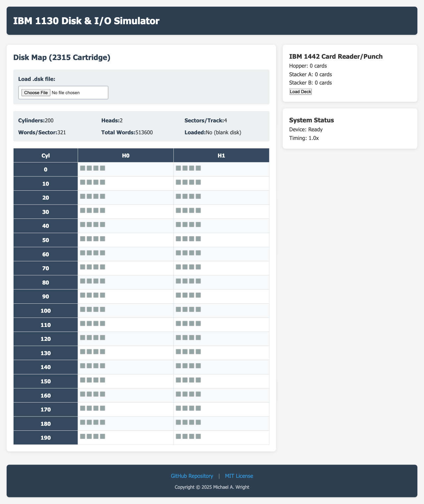

# IBM 1130 System Simulator

A historically accurate simulator for the IBM 1130 computer system, written in Rust with a browser-based interface using WebAssembly.

## Live Demo

**[Try the live demo →](https://softwarewrighter.github.io/demo-ibm-1130-system/)**



*Browser-based disk visualization showing IBM 2315 cartridge geometry with cylinder/head/sector layout*

## Overview

This project simulates vintage IBM 1130 peripheral devices with accurate timing models and geometry. The simulator is designed for educational purposes, providing visual feedback and realistic hardware behavior through a modern web interface.

### Simulated Hardware

- **Disk Drives**
  - IBM 2310 (2315 disk cartridge)
  - IBM 2311 (1316 disk pack)
- **Card Equipment**
  - IBM 1442 Card Reader/Punch
- **Printer**
  - IBM 1403 Line Printer
- **Multiplexor**
  - IBM 1133 Multiplexor

## Features

- **Accurate Timing Models**: Realistic simulation of 1960s hardware timing characteristics
- **Historical Fidelity**: Precise disk geometry, seek algorithms, and I/O timing
- **Browser-Based UI**: Modern WASM/Yew interface with visual feedback
- **Audio Feedback**: Synthesized disk seek sounds based on historical behavior
- **Test Infrastructure**: Comprehensive test suite with deterministic timing for CI/CD

## Quick Start

### Prerequisites

```bash
# Install Rust toolchain
curl --proto '=https' --tlsv1.2 -sSf https://sh.rustup.rs | sh
rustup target add wasm32-unknown-unknown

# Install Trunk (WASM bundler)
cargo install trunk
```

### Building

```bash
# Build entire workspace
cargo build --release

# Build and run web UI with hot reload (runs on port 1130)
cd crates/yew-ui
trunk serve --open
```

### Testing

```bash
# Run all tests
cargo test --all

# Run tests for specific crate
cargo test -p core-sim
```

## Project Structure

```
demo-ibm-1130-system/
  crates/
    core-sim/         # Pure Rust simulation core (no_std on WASM)
    yew-ui/           # WASM/Yew web interface
    fixtures/         # Sample disk images and card decks
  documentation/      # Design documentation and specifications
  docs/               # GitHub Pages - WASM build output (auto-generated)
  scripts/            # Build and deployment scripts
  images/             # Documentation images
```

### Core Components

- **`crates/core-sim/`**: Device implementations, timing models, file format handlers
  - Device traits: `DiskDevice`, `CardDevice`, `LinePrinter`, `Multiplexor`
  - Timing system with realistic/fast/none modes
  - Audio synthesis for disk seeks

- **`crates/yew-ui/`**: Browser-based visualization
  - Disk map viewer showing cylinder/head/sector layout
  - Card reader/punch interface
  - Console and status displays
  - IndexedDB storage for disk images

- **`crates/fixtures/`**: Test data and sample files
  - Disk images (`.dsk` format)
  - Card decks (`.deck` format)
  - Metadata catalog

## IBM 1130 Disk Characteristics

The simulator accurately models the IBM 2315 disk cartridge:

- **Capacity**: 512,000 16-bit words
- **Geometry**: 200 logical cylinders, 2 heads, 4 sectors/track
- **Sector Size**: 321 words (1 address word + 320 data words)
- **Rotation**: 1500 RPM (40ms per revolution)
- **Seek Time**: 7.5ms per 2-cylinder increment + 22.5ms settle time
- **Data Rate**: 27.8us per word

## File Formats

### Disk Images (`.dsk`)

Binary format with header containing:
- 8-byte magic identifier: `I1130DSK`
- Geometry specification
- Raw 16-bit word data (little-endian)

### Card Decks (`.deck`)

- Header specifying encoding (EBCDIC/ASCII) and binary mode
- 80-byte card frames

## Development

This project follows strict Test-Driven Development (TDD) practices. See [`docs/process.md`](docs/process.md) for detailed development guidelines.

### Quality Checks (run before every commit)

```bash
cargo fmt --all
cargo clippy --all-targets --all-features -- -D warnings
cargo test --all
cargo build --all
```

### Rust Edition

All crates use **Rust edition 2024**.

## Documentation

Comprehensive documentation is available in the [`documentation/`](documentation/) directory:

- [`process.md`](documentation/process.md) - Development methodology and standards
- [`ibm_1130_disk_i_o_simulator_starter_docs.md`](documentation/ibm_1130_disk_i_o_simulator_starter_docs.md) - Complete system specification
- [`research.md`](documentation/research.md) - Historical IBM 1130 facts and fidelity policy
- [`plan.md`](documentation/plan.md) - Development milestones
- [`status.md`](documentation/status.md) - Current project status
- [`ui-testing.md`](documentation/ui-testing.md) - UI testing guide with Playwright/MCP
- [`ui-test-results.md`](documentation/ui-test-results.md) - Latest UI test results

## License

Copyright (c) 2025 Michael A. Wright

Licensed under the MIT License. See [LICENSE](LICENSE) file for details.

## Contributing

Contributions are welcome! Please ensure all code:
- Follows TDD practices (write tests first)
- Passes all quality checks (fmt, clippy, test, build)
- Includes comprehensive documentation
- Maintains historical accuracy where applicable

## Acknowledgments

This simulator aims to preserve and make accessible the technology of the IBM 1130 computing system, which played an important role in the history of scientific and engineering computing during the 1960s and 1970s.
