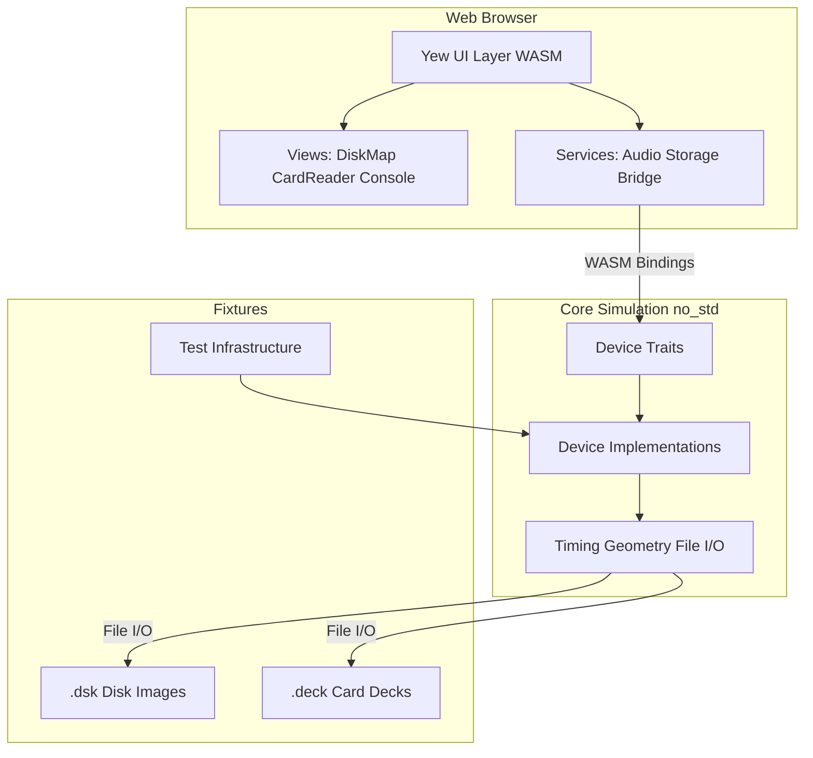
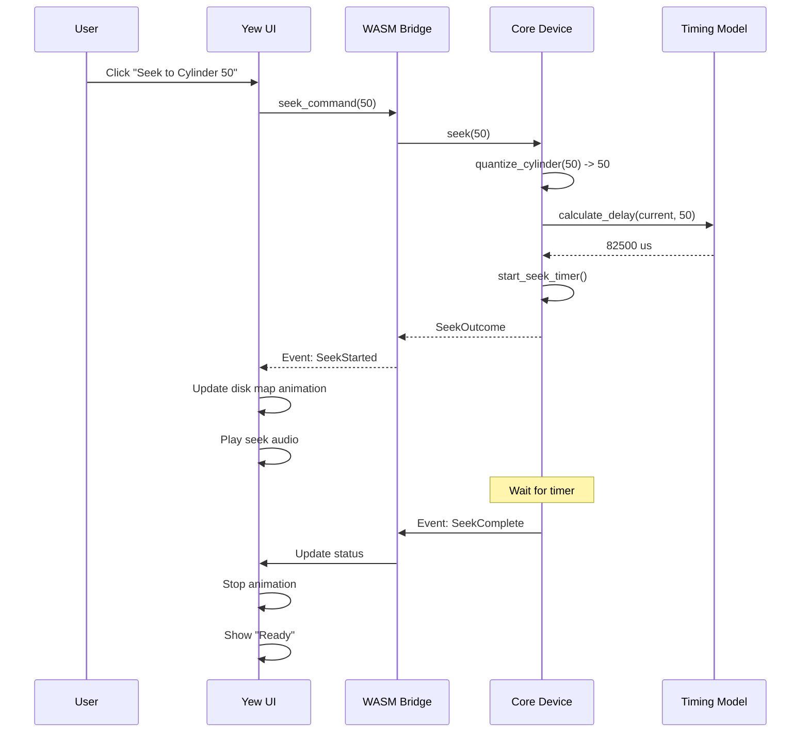
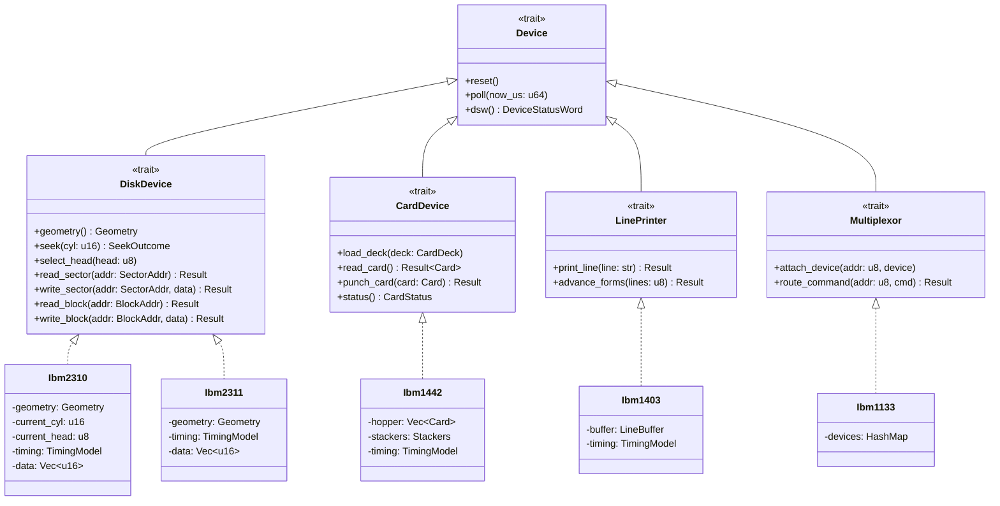
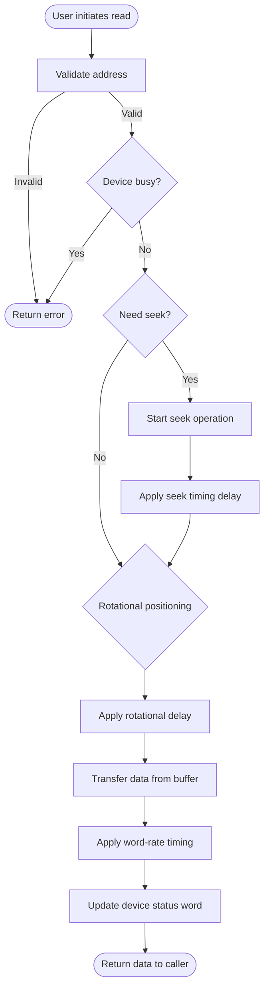
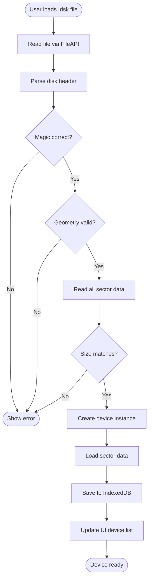
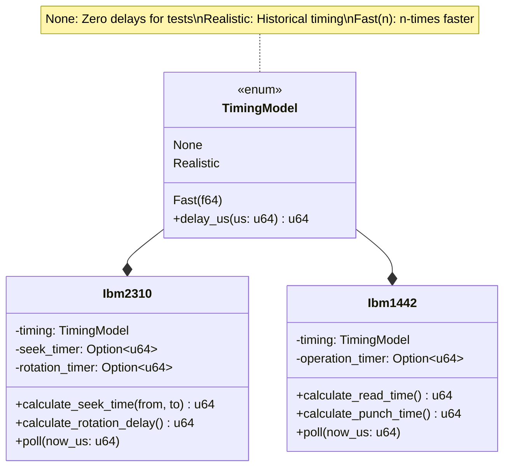

# System Architecture

The IBM 1130 Simulator uses a layered architecture that separates device simulation logic from visualization and user interaction.

## Architecture Principles

1. **Separation of Concerns** - Core simulation independent of UI
2. **Platform Agnostic Core** - Runs on native Rust or WASM
3. **Trait-Based Design** - Uniform device interfaces
4. **Parameterized Timing** - Realistic/fast/none timing modes
5. **Test-First Development** - All features driven by tests

## System Layers



## Crate Organization

The project uses a Cargo workspace with three crates:

### crates/core-sim

**Pure Rust simulation core (no_std on WASM)**

```
core-sim/
|-- src/
|   |-- lib.rs              # Public API
|   |-- timing.rs           # TimingModel (none/realistic/fast)
|   |-- audio.rs            # Seek sound parameter model
|   |-- cpu_bus.rs          # Device-channel handshake
|   |-- util.rs             # Shared utilities
|   |-- disk/
|   |   |-- mod.rs          # DiskDevice trait, Geometry, BlockAddr
|   |   |-- ibm2310.rs      # IBM 2310/2315 cartridge drive
|   |   |-- ibm2311.rs      # IBM 2311 disk pack drive
|   |   |-- file_io.rs      # .dsk file format
|   |-- card/
|   |   |-- mod.rs          # CardDevice trait
|   |   |-- ibm1442.rs      # IBM 1442 reader/punch
|   |-- printer/
|   |   |-- mod.rs          # LinePrinter trait
|   |   |-- ibm1403.rs      # IBM 1403 line printer
|   |-- mux/
|       |-- mod.rs          # Multiplexor trait
|       |-- ibm1133.rs      # IBM 1133 multiplexor
|-- Cargo.toml
```

**Key responsibilities:**
- Device simulation logic
- Timing calculations
- Geometry and addressing
- File format I/O (.dsk, .deck)
- No dependencies on web APIs

### crates/yew-ui

**WASM/Yew-based browser UI**

```
yew-ui/
|-- src/
|   |-- main.rs             # Entry point
|   |-- app.rs              # Root component
|   |-- views/
|   |   |-- mod.rs
|   |   |-- disk_map.rs     # Cylinder/sector visualization
|   |   |-- card_reader.rs  # Hopper/transport/stacker animation
|   |   |-- console.rs      # Device status word display
|   |   |-- status_bar.rs   # System-wide status
|   |   |-- demos.rs        # Demo selector
|   |   |-- hardware.rs     # Hardware catalog
|   |   |-- overview.rs     # System overview
|   |   |-- reference.rs    # Reference documentation
|   |-- services/
|       |-- mod.rs
|       |-- audio.rs        # WebAudio integration
|       |-- storage.rs      # IndexedDB persistence
|       |-- bridge.rs       # WASM bridge to core-sim
|-- Cargo.toml
|-- index.html
```

**Key responsibilities:**
- Visual components
- User interaction
- WebAudio seek sounds
- IndexedDB persistence
- WASM bindings to core-sim

### crates/fixtures

**Test data and samples**

```
fixtures/
|-- src/
|   |-- lib.rs              # Test infrastructure
|-- data/
|   |-- disks/
|   |   |-- demo2315.dsk    # Sample 2315 image
|   |   |-- demo2311.dsk    # Sample 2311 image
|   |-- cards/
|   |   |-- HELLO.deck      # Sample card deck
|   |   |-- DISKWRITE.deck
|   |   |-- PUNCHOUT.deck
|   |-- metadata/
|       |-- catalog.json    # Fixture catalog
|-- Cargo.toml
```

**Key responsibilities:**
- Sample disk images
- Sample card decks
- Test data for integration tests
- Automated tests for project standards

## Component Interaction



## Device Trait Hierarchy



## Data Flow

### Read Operation Flow



### File Loading Flow



## Timing Architecture



### Timing Modes

1. **TimingModel::None**
   - All delays return 0
   - For deterministic testing
   - Operations complete instantly

2. **TimingModel::Realistic**
   - 1x historical timing
   - 1500 RPM rotation
   - 27.8us/word transfer
   - 7.5ms/2-cyl seek

3. **TimingModel::Fast(n)**
   - n-times faster than realistic
   - For demos and fast-forward
   - Example: Fast(10.0) = 10x speed

## Technology Stack

| Layer | Technology | Purpose |
|-------|-----------|---------|
| UI Framework | Yew | React-like framework for Rust/WASM |
| Build Tool | Trunk | WASM bundler and dev server |
| Language | Rust 2024 | Core simulation and UI |
| Target | wasm32-unknown-unknown | Browser execution |
| Audio | WebAudio API | Seek sound synthesis |
| Storage | IndexedDB (via gloo) | Persistent disk images |
| Testing | cargo test | Native tests |
| Testing | wasm-bindgen-test | Browser tests |

## Design Patterns

### Trait-Based Polymorphism

All devices implement common `Device` trait for uniform lifecycle management:

```rust
pub trait Device {
    fn reset(&mut self);           // Initialize to known state
    fn poll(&mut self, now_us: u64); // Advance timers, complete ops
    fn dsw(&self) -> DeviceStatusWord; // Get status flags
}
```

### Strategy Pattern

`TimingModel` allows swapping timing strategies without changing device logic:

```rust
// Test with no delays
let disk = Ibm2310::new(TimingModel::None);

// Demo with realistic timing
let disk = Ibm2310::new(TimingModel::Realistic);

// Fast-forward 10x
let disk = Ibm2310::new(TimingModel::Fast(10.0));
```

### Observer Pattern

UI components subscribe to device events:

```rust
// Device emits event
device.notify(DeviceEvent::SeekComplete);

// UI receives and updates
on_device_event(event) {
    match event {
        SeekComplete => update_disk_map(),
        ReadComplete(data) => display_data(data),
    }
}
```

## Security Considerations

- **WASM Sandboxing** - Memory safety and isolation
- **Input Validation** - All file formats validated before processing
- **No Network Access** - Operates entirely locally
- **Safe Rust** - No unsafe code in public APIs

## Performance Considerations

- **WASM Optimization** - Release builds with size and speed optimization
- **Incremental Rendering** - Only update changed UI components
- **Lazy Loading** - Disk images loaded on-demand
- **Efficient Geometry** - Pre-calculated sector index mappings

## Future Architecture Enhancements

### CPU Integration (Phase 2)

When CPU simulation is added:

- Extend `ChannelBus` trait for full I/O channel protocol
- Implement interrupt handling (IRQ lines)
- Add DMA simulation (word-strobe transfers)
- Memory-mapped I/O for device commands

### Console Components

The IBM 1131 CPU console requires multiple UI components:

- **Console Keyboard** - Alphanumeric input
- **Console Switches** - Program load, run/stop, single-step
- **Console Printer** - IBM Selectric type-ball printer
  - Interchangeable type-balls (APL, FORTRAN, etc.)
  - Critical for APL demonstrations
- **Console Indicators** - Register displays (ACC, EXT, IAR, XR1-3)
- **Mode Selector** - Run/Load/Display/Single-step knob

## Related Pages

- [[Core-Simulation]] - Core simulation layer details
- [[Web-UI]] - UI layer and components
- [[Devices]] - Device specifications
- [[Development]] - Development workflow

## Related Documentation

- [Complete Architecture Document](../documentation/architecture.md)
- [Design Decisions](../documentation/design.md)
- [PRD and Use Cases](../documentation/PRD.md)
