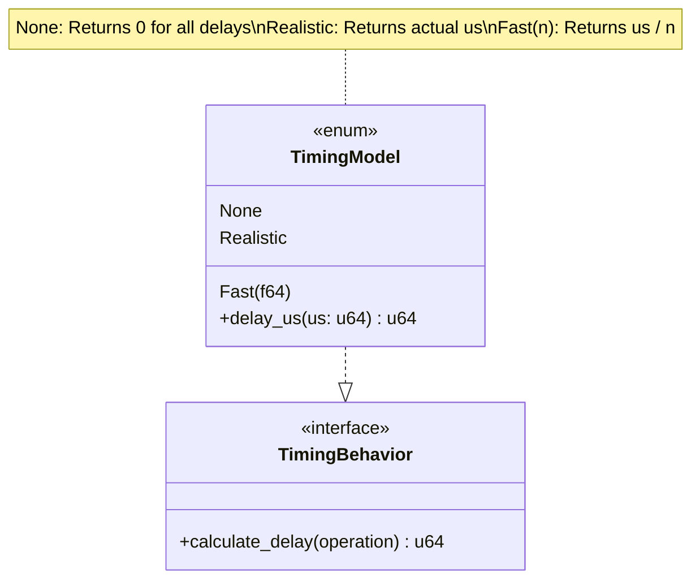
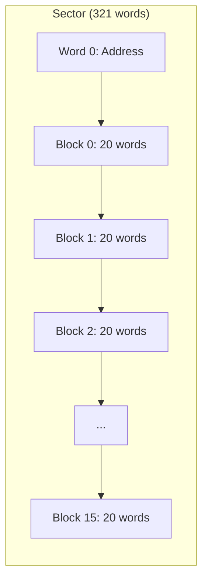
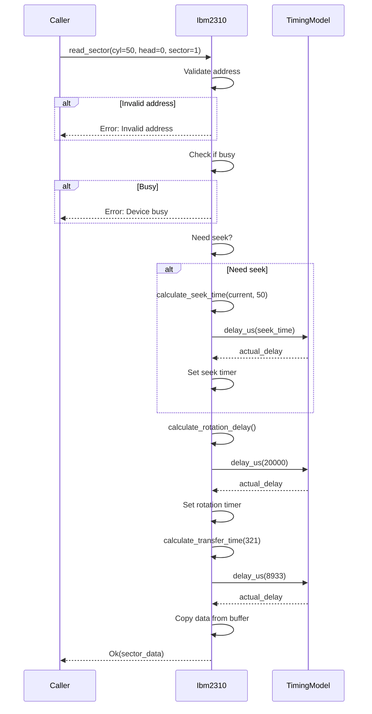
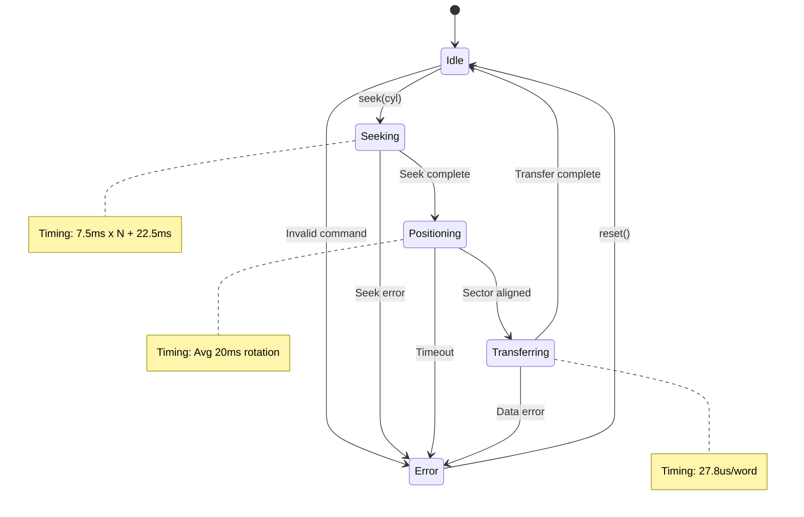

# Core Simulation Layer

The core simulation layer (`crates/core-sim`) provides platform-agnostic device simulation with historically accurate timing and geometry.

## Overview

**Crate:** `core-sim`
**Target:** Native Rust + wasm32-unknown-unknown (no_std)
**Purpose:** Pure device simulation logic without UI dependencies

## Module Organization

```
core-sim/src/
|-- lib.rs              # Public API exports
|-- timing.rs           # TimingModel (none/realistic/fast)
|-- audio.rs            # Seek sound synthesis parameters
|-- cpu_bus.rs          # Device-channel communication
|-- util.rs             # Shared utilities
|-- disk/
|   |-- mod.rs          # DiskDevice trait, Geometry, addressing
|   |-- ibm2310.rs      # IBM 2310/2315 implementation
|   |-- ibm2311.rs      # IBM 2311 implementation
|   |-- file_io.rs      # .dsk file format I/O
|-- card/
|   |-- mod.rs          # CardDevice trait
|   |-- ibm1442.rs      # IBM 1442 implementation
|-- printer/
|   |-- mod.rs          # LinePrinter trait
|   |-- ibm1403.rs      # IBM 1403 implementation
|-- mux/
    |-- mod.rs          # Multiplexor trait
    |-- ibm1133.rs      # IBM 1133 implementation
```

## Device Trait System

### Base Device Trait

All devices implement the base `Device` trait:

```rust
pub trait Device {
    /// Reset device to initial state
    fn reset(&mut self);

    /// Advance internal timers and complete pending operations
    fn poll(&mut self, now_us: u64);

    /// Get device status word (busy, error, attention flags)
    fn dsw(&self) -> DeviceStatusWord;
}
```

**Key methods:**
- `reset()` - Initialize device to known state (power-on)
- `poll(now_us)` - Called regularly to advance timers and complete operations
- `dsw()` - Return device status word with busy/error/attention flags

### DiskDevice Trait

```rust
pub trait DiskDevice: Device {
    fn geometry(&self) -> &DiskGeometry;
    fn seek(&mut self, cyl: u16) -> SeekOutcome;
    fn select_head(&mut self, head: u8);
    fn read_sector(&mut self, addr: SectorAddr) -> Result<Vec<u16>>;
    fn write_sector(&mut self, addr: SectorAddr, data: &[u16]) -> Result<()>;
    fn read_block(&mut self, addr: BlockAddr) -> Result<Vec<u16>>;
    fn write_block(&mut self, addr: BlockAddr, data: &[u16]) -> Result<()>;
}
```

**Operations:**
- `seek(cyl)` - Position heads to cylinder (quantized for 2315)
- `select_head(head)` - Select read/write head (0 or 1 for 2315)
- `read_sector(addr)` - Read 321-word sector
- `write_sector(addr, data)` - Write 321-word sector
- `read_block(addr)` - Read 20-word logical block
- `write_block(addr, data)` - Write 20-word logical block

### CardDevice Trait

```rust
pub trait CardDevice: Device {
    fn load_deck(&mut self, deck: CardDeck);
    fn read_card(&mut self) -> Result<Card>;
    fn punch_card(&mut self, card: &Card) -> Result<()>;
    fn status(&self) -> CardStatus;
}
```

**Operations:**
- `load_deck(deck)` - Load cards into hopper
- `read_card()` - Read next card from hopper (400 cpm max)
- `punch_card(card)` - Punch card to stacker (360 cpm max)
- `status()` - Get hopper/stacker counts and state

### LinePrinter Trait

```rust
pub trait LinePrinter: Device {
    fn print_line(&mut self, line: &str) -> Result<()>;
    fn advance_forms(&mut self, lines: u8) -> Result<()>;
}
```

**Operations:**
- `print_line(line)` - Print 120-132 character line
- `advance_forms(lines)` - Advance paper by N lines

### Multiplexor Trait

```rust
pub trait Multiplexor: Device {
    fn attach_device(&mut self, addr: u8, device: Box<dyn Device>);
    fn route_command(&mut self, addr: u8, cmd: IoCommand) -> Result<()>;
}
```

**Operations:**
- `attach_device(addr, device)` - Attach device at address
- `route_command(addr, cmd)` - Route I/O command to device

## Timing Model



### Timing Modes

**TimingModel::None**
```rust
let disk = Ibm2310::new(TimingModel::None);
disk.seek(50); // Completes instantly
```
- All operations complete instantly
- For deterministic testing
- No race conditions

**TimingModel::Realistic**
```rust
let disk = Ibm2310::new(TimingModel::Realistic);
disk.seek(50); // Takes 82.5ms (real 2315 timing)
```
- 1x historical timing
- Educational demonstrations
- Authentic experience

**TimingModel::Fast(multiplier)**
```rust
let disk = Ibm2310::new(TimingModel::Fast(10.0));
disk.seek(50); // Takes 8.25ms (10x faster)
```
- n-times faster than realistic
- For demos and fast-forward
- Still maintains timing relationships

## Geometry and Addressing

### Disk Geometry

```rust
#[derive(Clone, Copy, Debug)]
pub struct DiskGeometry {
    pub cylinders: u16,      // 200 logical for 2315
    pub heads: u8,           // 2 (top/bottom)
    pub sectors_per_track: u8, // 4
    pub words_per_sector: u16, // 321 (word 0 = address)
}
```

**IBM 2315 (2310 drive) geometry:**
- 200 logical cylinders (203 physical with 3 alternates)
- 2 heads (top and bottom surfaces)
- 4 sectors per track
- 321 words per sector (word 0 = sector address, 320 payload)
- Total: 512,000 words (~1 MB)

### Sector Addressing

```rust
#[derive(Clone, Copy, Debug)]
pub struct SectorAddr {
    pub cyl: u16,    // 0-199 for 2315
    pub head: u8,    // 0 or 1
    pub sector: u8,  // 0-3 (logical)
}
```

**Sector numbering:**
- Sectors 0-3 are on head 0
- Sectors 4-7 are on head 1
- Physical sector: `head * 4 + sector`

**Linear sector index:**
```
idx = cyl * 8 + (head * 4 + sector)
```

### Block Addressing

```rust
#[derive(Clone, Copy, Debug)]
pub struct BlockAddr {
    pub cyl: u16,    // Cylinder number
    pub head: u8,    // 0 or 1 for 2315
    pub sector: u8,  // 0-7 (includes head bit)
    pub block: u8,   // 0-15 within sector
}
```

**Logical blocks:**
- 16 blocks per sector
- 20 words per block
- Blocks skip the sector address word
- Block N: words `[1 + N*20 .. 1 + N*20 + 19]`



## IBM 2310/2315 Implementation

### Seek Quantization

The 2315 seeks in 2-cylinder increments due to mechanical design:

```rust
fn quantize_cylinder(&self, cyl: u16) -> u16 {
    (cyl / 2) * 2  // Round down to nearest even cylinder
}
```

**Examples:**
- Seek to 0 -> 0
- Seek to 1 -> 0 (quantized to even)
- Seek to 50 -> 50
- Seek to 51 -> 50 (quantized to even)

### Seek Timing

```rust
fn calculate_seek_time(&self, from: u16, to: u16) -> u64 {
    let from_q = self.quantize_cylinder(from);
    let to_q = self.quantize_cylinder(to);
    let delta = ((to_q as i32 - from_q as i32).abs() / 2) as f64;
    let time_ms = delta * 7.5 + 22.5;  // 7.5ms/2-cyl + 22.5ms settle
    self.timing.delay_us((time_ms * 1000.0) as u64)
}
```

**Timing formula:** `t = 7.5ms x N_even + 22.5ms`

**Examples:**
- Seek 0 -> 0: 22.5ms (settle only)
- Seek 0 -> 2: 30ms (1 increment + settle)
- Seek 0 -> 50: 210ms (25 increments + settle)

### Rotational Latency

```rust
fn calculate_rotation_delay(&self) -> u64 {
    // 1500 RPM = 40ms/rev
    // Average delay = 20ms
    // For determinism, use average
    self.timing.delay_us(20_000)
}
```

- **RPM:** 1500
- **Revolution time:** 40ms
- **Average latency:** 20ms
- **Sector window:** ~10ms (4 sectors/track)

### Word Transfer Rate

```rust
fn calculate_transfer_time(&self, words: u16) -> u64 {
    // 27.8us per word
    self.timing.delay_us((words as u64) * 27_800 / 1000)
}
```

- **Rate:** 27.8us/word
- **Sector (321 words):** ~8.9ms
- **Block (20 words):** ~0.6ms

## Read/Write Operation Flow



## Device State Machine



## File I/O

### Loading Disk Images

```rust
pub fn load_disk_image(path: &Path) -> Result<Ibm2310> {
    let data = fs::read(path)?;

    // Validate magic
    if &data[0..8] != b"I1130DSK" {
        return Err(Error::InvalidMagic);
    }

    // Parse geometry
    let geo = parse_geometry(&data[8..24])?;

    // Read sector data
    let sectors = parse_sectors(&data[56..], &geo)?;

    Ok(Ibm2310::from_data(geo, sectors))
}
```

### Saving Disk Images

```rust
pub fn save_disk_image(&self, path: &Path) -> Result<()> {
    let mut buf = Vec::new();

    // Write magic
    buf.extend_from_slice(b"I1130DSK");

    // Write geometry
    buf.extend_from_slice(&self.geometry.serialize());

    // Write reserved area
    buf.extend_from_slice(&[0u8; 32]);

    // Write sector data
    for word in &self.data {
        buf.extend_from_slice(&word.to_le_bytes());
    }

    fs::write(path, buf)
}
```

## Testing Strategy

### Unit Tests

Each module has co-located tests:

```rust
#[cfg(test)]
mod tests {
    use super::*;

    #[test]
    fn test_seek_quantization() {
        let disk = Ibm2310::new(TimingModel::None);
        assert_eq!(disk.quantize_cylinder(0), 0);
        assert_eq!(disk.quantize_cylinder(1), 0);
        assert_eq!(disk.quantize_cylinder(50), 50);
        assert_eq!(disk.quantize_cylinder(51), 50);
    }

    #[test]
    fn test_sector_address_calculation() {
        let addr = SectorAddr { cyl: 10, head: 0, sector: 2 };
        let idx = calculate_sector_index(&addr);
        assert_eq!(idx, 82); // 10 * 8 + 2
    }
}
```

### Integration Tests

Test device interactions:

```rust
#[test]
fn test_read_after_seek() {
    let mut disk = Ibm2310::new(TimingModel::None);

    // Seek to cylinder 50
    let outcome = disk.seek(50);
    assert!(outcome.is_ok());

    // Read sector
    let addr = SectorAddr { cyl: 50, head: 0, sector: 0 };
    let data = disk.read_sector(addr);
    assert!(data.is_ok());
    assert_eq!(data.unwrap().len(), 321);
}
```

### Timing Tests

Verify timing calculations:

```rust
#[test]
fn test_realistic_timing() {
    let disk = Ibm2310::new(TimingModel::Realistic);

    let seek_time = disk.calculate_seek_time(0, 50);
    assert_eq!(seek_time, 210_000); // 210ms

    let rot_time = disk.calculate_rotation_delay();
    assert_eq!(rot_time, 20_000); // 20ms
}

#[test]
fn test_none_timing() {
    let disk = Ibm2310::new(TimingModel::None);

    let seek_time = disk.calculate_seek_time(0, 50);
    assert_eq!(seek_time, 0); // Instant
}
```

## Performance Considerations

- **Pre-allocated buffers** - Avoid allocations during I/O operations
- **Efficient indexing** - Pre-calculate sector offsets
- **Copy-on-write** - Share geometry data across instances
- **WASM optimization** - Compiled with size and speed optimizations

## Error Handling

All device operations return `Result<T, DeviceError>`:

```rust
pub enum DeviceError {
    InvalidAddress,
    DeviceBusy,
    NotReady,
    DataError,
    HardwareError(String),
}
```

**Error scenarios:**
- Invalid cylinder/head/sector address
- Device busy with another operation
- Device not ready (no disk mounted)
- Data parity or validation error
- Hardware simulation error

## Related Pages

- [[Architecture]] - Overall system architecture
- [[Devices]] - Device specifications and timing details
- [[File-Formats]] - File format specifications
- [[Development]] - Development and testing workflow

## Related Documentation

- [Complete Specifications](../documentation/ibm_1130_disk_i_o_simulator_starter_docs.md)
- [Design Decisions](../documentation/design.md)
- [Research Notes](../documentation/research.md)
