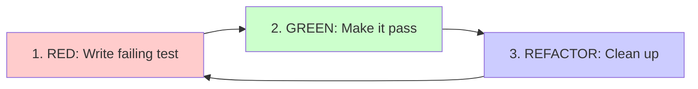
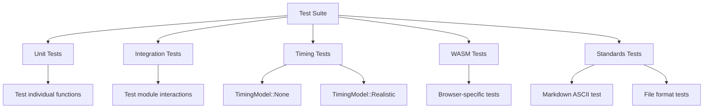

# Development Guide

Complete guide for developing, testing, and contributing to the IBM 1130 Simulator.

## Development Methodology

This project follows **strict Test-Driven Development (TDD)** with comprehensive quality checks before every commit.

### Test-Driven Development (TDD)

**All features and bug fixes MUST follow the Red/Green/Refactor cycle:**



**Step 1: RED - Write a failing test**
```rust
#[test]
fn test_seek_quantization() {
    let mut disk = Ibm2310::new(TimingModel::None);
    let outcome = disk.seek(5);
    assert_eq!(outcome.quantized_cyl, 4); // Should quantize to even
}
```

**Step 2: GREEN - Implement minimum code to pass**
```rust
pub fn seek(&mut self, cyl: u16) -> SeekOutcome {
    let quantized = (cyl / 2) * 2;  // Quantize to even cylinder
    self.current_cyl = quantized;
    SeekOutcome { quantized_cyl: quantized }
}
```

**Step 3: REFACTOR - Clean up while keeping tests green**
```rust
fn quantize_cylinder(&self, cyl: u16) -> u16 {
    (cyl / 2) * 2
}

pub fn seek(&mut self, cyl: u16) -> SeekOutcome {
    let quantized = self.quantize_cylinder(cyl);
    self.current_cyl = quantized;
    SeekOutcome { quantized_cyl: quantized }
}
```

### Code Organization Principles

**Modular architecture:**
- Separate crates for major components
- Separate modules for orthogonal concerns
- Short functions (<=30 lines preferred)
- Test each function
- Document public APIs

**Example of well-structured code:**
```rust
/// Calculate seek time for 2315 disk based on cylinder distance.
///
/// The 2315 seeks in 2-cylinder increments with timing formula:
/// t = 7.5ms x N_even + 22.5ms settle
fn calculate_seek_time(&self, from: u16, to: u16) -> u64 {
    let delta = ((to as i32 - from as i32).abs() / 2) as f64;
    let time_ms = delta * 7.5 + 22.5;
    self.timing.delay_us((time_ms * 1000.0) as u64)
}

#[cfg(test)]
mod tests {
    use super::*;

    #[test]
    fn test_seek_time_same_cylinder() {
        let disk = Ibm2310::new(TimingModel::Realistic);
        assert_eq!(disk.calculate_seek_time(0, 0), 22_500);
    }

    #[test]
    fn test_seek_time_two_cylinders() {
        let disk = Ibm2310::new(TimingModel::Realistic);
        assert_eq!(disk.calculate_seek_time(0, 2), 30_000);
    }
}
```

## Prerequisites

### Install Rust

```bash
# Install rustup (Rust toolchain manager)
curl --proto '=https' --tlsv1.2 -sSf https://sh.rustup.rs | sh

# Add WASM target
rustup target add wasm32-unknown-unknown
```

### Install Build Tools

```bash
# Install Trunk (WASM bundler and dev server)
cargo install trunk

# Install wasm-bindgen-cli (for testing)
cargo install wasm-bindgen-cli
```

### Verify Installation

```bash
rustc --version    # Should be 1.75+ for edition 2024
cargo --version
trunk --version
```

## Quality Assurance Checklist

**Before EVERY commit, run these checks in order:**

### 1. Code Formatting

```bash
cargo fmt --all
```

- Uses Rust standard formatting
- **NEVER skip formatting**
- Ensures consistent code style

### 2. Linting (Clippy)

```bash
cargo clippy --all-targets --all-features -- -D warnings
```

- Fix **ALL** clippy warnings
- **DO NOT** use `#[allow(clippy::...)]` to disable checks
- If clippy seems wrong, refactor code to satisfy it

**Common clippy warnings and fixes:**
- **Unused variable:** Remove it or use it
- **Unnecessary clone:** Remove the .clone()
- **Redundant field names:** Use shorthand syntax
- **Match can be simplified:** Use if let or matches!

### 3. Run All Tests

```bash
cargo test --all
```

- **ALL tests must pass**
- **NEVER** disable tests with `#[ignore]` without documentation
- Add new tests for new functionality

### 4. Verify Build

```bash
# Native build
cargo build --all

# WASM build (if UI changes)
cd crates/yew-ui
trunk build --release
```

### 5. Update Documentation

- Update doc comments for changed public APIs
- Update docs/status.md if feature status changes
- Update CLAUDE.md if architecture changes
- Update README.md if user-facing changes

## Pre-Commit Checklist Script

Save this as `.git/hooks/pre-commit` and chmod +x:

```bash
#!/bin/bash
set -e

echo "Running pre-commit checks..."

echo "1. Formatting code..."
cargo fmt --all --check || {
    echo "ERROR: Code not formatted. Run: cargo fmt --all"
    exit 1
}

echo "2. Running clippy..."
cargo clippy --all-targets --all-features -- -D warnings || {
    echo "ERROR: Clippy warnings found. Fix them first."
    exit 1
}

echo "3. Running tests..."
cargo test --all || {
    echo "ERROR: Tests failed. Fix them first."
    exit 1
}

echo "4. Building project..."
cargo build --all || {
    echo "ERROR: Build failed."
    exit 1
}

echo "All checks passed!"
```

## Testing Strategy

### Test Categories



### Unit Tests

Co-located with code using `#[cfg(test)]`:

```rust
// src/disk/ibm2310.rs

impl Ibm2310 {
    // Implementation
}

#[cfg(test)]
mod tests {
    use super::*;

    #[test]
    fn test_quantize_cylinder() {
        let disk = Ibm2310::new(TimingModel::None);
        assert_eq!(disk.quantize_cylinder(0), 0);
        assert_eq!(disk.quantize_cylinder(1), 0);
        assert_eq!(disk.quantize_cylinder(50), 50);
        assert_eq!(disk.quantize_cylinder(51), 50);
    }
}
```

### Integration Tests

Test interactions between modules:

```rust
#[test]
fn test_read_after_seek() {
    let mut disk = Ibm2310::new(TimingModel::None);

    // Seek first
    let seek_result = disk.seek(50);
    assert!(seek_result.is_ok());

    // Then read
    let addr = SectorAddr { cyl: 50, head: 0, sector: 0 };
    let read_result = disk.read_sector(addr);
    assert!(read_result.is_ok());
    assert_eq!(read_result.unwrap().len(), 321);
}
```

### Timing Tests

Use `TimingModel::None` for determinism:

```rust
#[test]
fn test_deterministic_read() {
    let mut disk = Ibm2310::new(TimingModel::None);

    // All operations complete instantly
    let start = Instant::now();
    disk.seek(100);
    let addr = SectorAddr { cyl: 100, head: 0, sector: 0 };
    disk.read_sector(addr);
    let elapsed = start.elapsed();

    // Should be nearly instant (< 1ms)
    assert!(elapsed.as_millis() < 1);
}
```

Verify realistic timing calculations:

```rust
#[test]
fn test_realistic_seek_timing() {
    let disk = Ibm2310::new(TimingModel::Realistic);
    let time = disk.calculate_seek_time(0, 50);
    assert_eq!(time, 210_000); // 210ms
}
```

### WASM Tests

Use `wasm-bindgen-test` for browser tests:

```rust
#[cfg(target_arch = "wasm32")]
use wasm_bindgen_test::*;

#[cfg(target_arch = "wasm32")]
#[wasm_bindgen_test]
fn test_ui_component() {
    // Test UI component in browser
}
```

Run with:
```bash
wasm-pack test --headless --firefox
```

### Test Naming Conventions

Use descriptive names that explain what is tested:

**Good:**
```rust
#[test]
fn test_read_sector_with_invalid_address_returns_error() { }

#[test]
fn test_seek_quantizes_odd_cylinders_to_even() { }

#[test]
fn test_block_addr_conversion_to_linear_index() { }
```

**Bad:**
```rust
#[test]
fn test1() { }

#[test]
fn test_disk() { }
```

## Build Commands

### Development

```bash
# Build entire workspace
cargo build

# Build specific crate
cargo build -p core-sim

# Build with optimizations
cargo build --release
```

### WASM UI Development

```bash
# Change to UI crate
cd crates/yew-ui

# Development server (hot reload on port 8080)
trunk serve --open

# Production build (output to dist/)
trunk build --release

# Custom port
trunk serve --port 3000 --open
```

### Testing

```bash
# Run all tests
cargo test --all

# Run tests for specific crate
cargo test -p core-sim

# Run specific test
cargo test test_seek_quantization

# Run tests with output
cargo test -- --nocapture

# Run tests in release mode (faster)
cargo test --release
```

## Commit Standards

### Commit Message Format

```
<type>: <short summary (50 chars or less)>

<detailed explanation of what changed and why (wrap at 72 chars)>

- Bullet points for multiple changes
- Reference issue numbers if applicable (#123)
- Explain trade-offs or design decisions
```

### Commit Types

- **feat:** New feature
- **fix:** Bug fix
- **refactor:** Code restructuring without behavior change
- **test:** Adding or updating tests
- **docs:** Documentation changes
- **chore:** Build, dependencies, tooling

### Good Commit Examples

**Example 1: Feature**
```
feat: implement 2-cylinder seek quantization for IBM 2310

The IBM 2315 cartridge drive seeks in increments of 2 cylinders
due to mechanical constraints. This commit adds quantization logic
to round all seek targets down to the nearest even cylinder.

- Added quantize_cylinder() method to Ibm2310
- Updated seek timing calculation for quantized moves
- Added tests for odd/even cylinder seek behavior
- Updated documentation with quantization details

Refs: docs/ibm_1130_disk_i_o_simulator_starter_docs.md (seek specs)
```

**Example 2: Bug Fix**
```
fix: correct sector index calculation for head 1

The sector index formula was not accounting for head offset correctly,
causing reads from head 1 to access wrong sectors. Fixed formula to:
idx = cyl * 8 + (head * 4 + sector)

- Fixed calculate_sector_index() in disk/mod.rs
- Added test to verify head 0 and head 1 indexing
- Verified fix with manual sector read tests

Fixes #42
```

**Example 3: Refactor**
```
refactor: extract timing calculations to separate module

Timing calculations were duplicated across device implementations.
Extracted common timing logic to timing.rs module for reuse.

- Created TimingModel enum (None/Realistic/Fast)
- Moved delay calculations to timing module
- Updated all devices to use TimingModel
- All tests still pass with no behavior change
```

### Push Policy

**Always push commits after quality checks pass:**

```bash
git add .
git commit -m "feat: ..."
# Run quality checks (fmt, clippy, test, build)
git push origin <branch-name>
```

**Why push frequently:**
- Backup work against local failure
- Enable CI/CD testing
- Make progress visible
- Create recoverable checkpoints

## Markdown File Requirements (CRITICAL)

**ALL .md files MUST use ASCII-only encoding.**

### Prohibited Characters

**NEVER use these in markdown:**
- Unicode arrows: Use -> <- <-> instead
- Unicode bullets: Use - or * instead
- Unicode boxes: Use + | - instead
- Smart quotes: Use " " ' instead
- Math symbols: Use <= >= != instead
- Greek letters: Write out mu pi alpha instead

### How to Check

```bash
# Automated test (will fail if non-ASCII found)
cargo test --all

# Manual check
find . -name "*.md" -exec perl -ne 'print "$ARGV:$.: $_" if /[^\x00-\x7F]/' {} +
```

### Why ASCII-Only?

1. Maximum compatibility across platforms
2. No encoding issues or mojibake
3. Works in all editors without special fonts
4. Automated tests WILL FAIL on non-ASCII
5. Copy-paste safe across systems

## Code Review Checklist

Before committing or requesting review:

- [ ] Does it follow TDD? (tests exist and pass)
- [ ] Is it modular? (appropriate boundaries)
- [ ] Are functions short and focused? (<=30 lines)
- [ ] Are public APIs documented? (/// doc comments)
- [ ] Does it pass all quality checks? (fmt, clippy, test)
- [ ] Is commit message clear and detailed?
- [ ] Has documentation been updated?
- [ ] Are constants used instead of magic numbers?
- [ ] Are error cases handled properly?
- [ ] Is the code testable? (minimal dependencies)

## Debugging

### Native Debugging

```bash
# Run with debug output
RUST_LOG=debug cargo run

# Run specific test with output
cargo test test_name -- --nocapture

# Debug with lldb/gdb
rust-lldb target/debug/core-sim
```

### WASM Debugging

```bash
# Browser DevTools
trunk serve --open
# Open browser DevTools (F12)
# Check Console tab for Rust panics

# WASM stack traces
RUST_BACKTRACE=1 trunk serve

# Logging from Rust to browser console
use web_sys::console;
console::log_1(&"Debug message".into());
```

## Performance Profiling

### Native Profiling

```bash
# Build with profiling symbols
cargo build --release --profile=release-with-debug

# Profile with perf (Linux)
perf record target/release/core-sim
perf report

# Profile with Instruments (macOS)
instruments -t "Time Profiler" target/release/core-sim
```

### WASM Profiling

```bash
# Browser Performance tab (F12 -> Performance)
trunk serve --open
# Start recording
# Perform operations
# Stop recording
# Analyze flame graph
```

## Continuous Integration

### GitHub Actions (Future)

```yaml
name: CI
on: [push, pull_request]
jobs:
  test:
    runs-on: ubuntu-latest
    steps:
      - uses: actions/checkout@v2
      - uses: actions-rs/toolchain@v1
        with:
          toolchain: stable
      - run: cargo fmt --all --check
      - run: cargo clippy --all-targets --all-features -- -D warnings
      - run: cargo test --all
      - run: cargo build --all
```

## Related Pages

- [[Architecture]] - System architecture
- [[Core-Simulation]] - Device implementation
- [[Devices]] - Device specifications
- [[File-Formats]] - File formats

## Related Documentation

- [Process Guide](../documentation/process.md) - Complete development process
- [Project Status](../documentation/status.md) - Current status and roadmap
- [PRD](../documentation/PRD.md) - Product requirements
