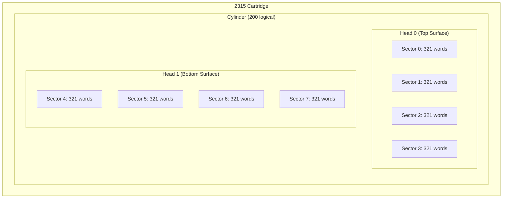
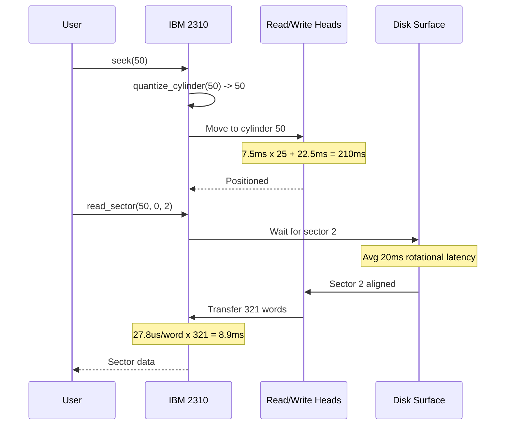
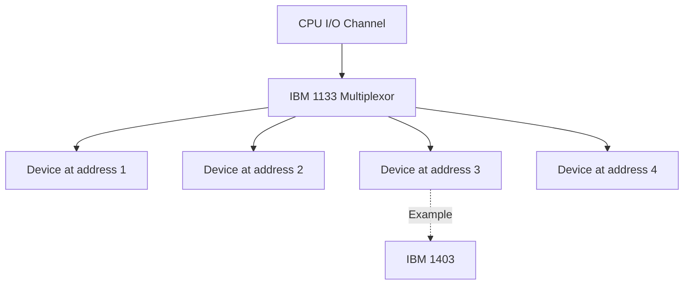
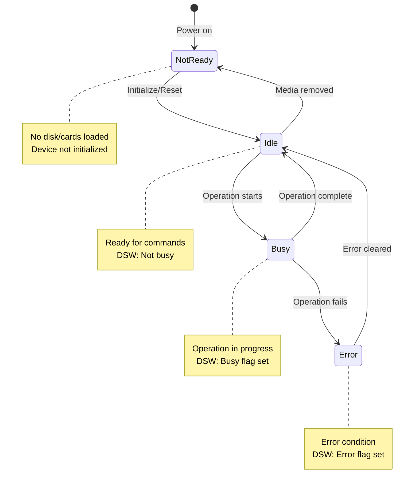

# Device Specifications

Complete specifications for all simulated IBM 1130 peripheral devices.

## Overview

The simulator models five peripheral devices with historically accurate geometry, timing, and behavior:

| Device | Model | Type | Purpose |
|--------|-------|------|---------|
| IBM 2310/2315 | Single disk drive | Disk storage | Removable cartridge (512K words) |
| IBM 2311 | Multi-platter drive | Disk storage | Fixed disk pack (1.5-2.5M words) |
| IBM 1442 | Card reader/punch | I/O | 80-column cards (400/360 cpm) |
| IBM 1403 | Line printer | Output | Chain/train printer (340-600 lpm) |
| IBM 1133 | Multiplexor | Controller | Device attachment and routing |

## IBM 2310/2315 Disk Drive

### Overview

The IBM 2310 is a single-disk storage drive using removable 2315 cartridges. The internal disk storage drive in the IBM 1130 uses the same 2315 cartridge format.

### Physical Characteristics

- **Cartridge:** IBM 2315 (removable)
- **Surfaces:** 2 (top and bottom)
- **Recording:** Magnetic oxide coating
- **Rotation:** 1500 RPM (40ms per revolution)
- **Access method:** Moving head per surface

### Geometry



**Specification:**
- **Cylinders:** 200 logical (203 physical with 3 alternates for defects)
- **Heads:** 2 (one per surface)
- **Sectors per track:** 4
- **Words per sector:** 321 (word 0 = sector address, 320 data payload)
- **Total capacity:** 512,000 words (~1,024 KB or ~1 MB)

**Sector layout:**
```
Sector 0-3: Head 0 (top surface)
Sector 4-7: Head 1 (bottom surface)
```

### Timing Characteristics

**Rotational:**
- **RPM:** 1500
- **Revolution time:** 40ms
- **Average rotational latency:** 20ms
- **Sector window:** ~10ms (1/4 revolution)

**Seek:**
- **Quantization:** 2-cylinder increments (mechanical constraint)
- **Formula:** `t = 7.5ms x N_even + 22.5ms settle`
- **Examples:**
  - 0 -> 0: 22.5ms (settle only)
  - 0 -> 2: 30ms (one 2-cyl increment)
  - 0 -> 50: 210ms (25 increments)
  - 0 -> 199: 765ms (worst case)

**Transfer:**
- **Word rate:** 27.8us per word
- **Sector (321 words):** ~8.9ms
- **Block (20 words):** ~0.56ms
- **Full track (8 sectors):** ~71ms
- **Full cylinder (8 sectors):** ~71ms + seek + rotation



### Addressing

**Sector addressing:**
```rust
SectorAddr {
    cyl: 0..199,      // Cylinder number
    head: 0..1,       // Head/surface
    sector: 0..3,     // Sector on track
}
```

**Block addressing (Disk Monitor System):**
```rust
BlockAddr {
    cyl: 0..199,      // Cylinder
    head: 0..1,       // Head
    sector: 0..7,     // Logical sector (includes head)
    block: 0..15,     // Block within sector
}
```

**Linear sector index:**
```
idx = cyl * 8 + (head * 4 + sector)
```

**Block word offset:**
```
word_offset = 1 + block * 20  // Skip sector address word
```

### Operations

**seek(cylinder):**
- Position heads to target cylinder
- Quantized to even cylinders
- Returns `SeekOutcome` with quantized position

**select_head(head):**
- Select active read/write head (0 or 1)

**read_sector(cyl, head, sector):**
- Read 321-word sector
- Includes seek + rotation + transfer time
- Returns sector data buffer

**write_sector(cyl, head, sector, data):**
- Write 321-word sector
- Includes seek + rotation + transfer time
- Recommended: read-check after write

**read_block(block_addr):**
- Read 20-word logical block
- DMS-compatible addressing

**write_block(block_addr, data):**
- Write 20-word logical block
- DMS-compatible addressing

## IBM 2311 Disk Drive

### Overview

The IBM 2311 is a multi-platter disk pack drive with higher capacity than the 2310. Cannot coexist with 2310 on same system.

### Geometry

- **Models:**
  - Model 11: ~2.56M words
  - Model 12: ~1.536M words
- **Platters:** Multiple (shared actuator)
- **Surfaces:** Multiple recording surfaces
- **Access:** All heads move together (shared actuator)

### Timing

- Similar rotational characteristics to 2315
- Seek timing affected by multiple platters
- Actuator positioning affects all surfaces simultaneously

## IBM 1442 Card Reader/Punch

### Overview

Combined card reader and punch supporting 80-column cards in EBCDIC or ASCII encoding.


### Physical Characteristics

- **Card size:** 80 columns x 12 rows (Hollerith encoding)
- **Hopper capacity:** ~1000 cards
- **Stacker capacity:** ~1000 cards each (A and B)
- **Encoding:** EBCDIC or ASCII
- **Binary mode:** Supported (12-bit per column)

### Timing Characteristics

**Read operation:**
- **Maximum rate:** 400 cards per minute
- **Time per card:** 150ms
- **Read mechanism:** 12-row brush contacts

**Punch operation:**
- **Maximum rate:** 360 cards per minute (model dependent)
- **Time per card:** ~167ms
- **Punch mechanism:** 80 column dies (punch 12 rows sequentially)

### Operations

**load_deck(deck):**
- Load card deck into hopper
- Deck contains 80-byte card images

**read_card():**
- Read next card from hopper
- Returns 80-character card image
- Decrements hopper count

**punch_card(card, to_stacker_b):**
- Punch card with given data
- Route to stacker A (normal) or B (select)
- Increments stacker count

**status():**
- Hopper card count
- Stacker A/B card counts
- Current operation state

### Card Format

**80-column card:**
```
Column:  1         10        20        30        40        50        60        70        80
Data:    [------------ 80 characters of text or binary data ----------------]
```

**Binary mode:**
- Each column encodes 12 bits (one per row)
- Allows arbitrary binary data
- Used for object code and data files

## IBM 1403 Line Printer

### Overview

High-speed chain/train printer for text output.

### Physical Characteristics

- **Print mechanism:** Chain or train technology
- **Character set:** 48 or 64 characters (depends on chain)
- **Line width:** 120 or 132 columns
- **Forms:** Continuous-feed paper with tractor sprockets

### Models

| Model | Speed | Technology |
|-------|-------|-----------|
| Model 6 | 340 lpm | Chain printer |
| Model 7 | 600 lpm | Chain printer |

### Timing Characteristics

**Print line:**
- Model 6: ~176ms per line (340 lpm)
- Model 7: ~100ms per line (600 lpm)
- Includes character positioning and hammer timing

**Form feed:**
- Paper advance: ~50ms per line
- Skip to top of form: ~500ms (typical 66-line page)

### Operations

**print_line(line):**
- Print text line (120 or 132 characters)
- Includes timing delay based on model

**advance_forms(lines):**
- Advance paper by N lines
- Timing: ~50ms per line

### Attachment

- **Controller:** IBM 1133 multiplexor required
- **Connection:** Via 1133 device address

## IBM 1133 Multiplexor

### Overview

Device controller that manages attachment and I/O command routing for multiple peripherals.

### Purpose

- Attach multiple devices to CPU I/O channel
- Route I/O commands to correct device
- Manage device addressing
- Required for 1403 printer attachment

### Architecture



### Operations

**attach_device(addr, device):**
- Attach device at specified address (0-15)
- Device receives commands via this address

**route_command(addr, cmd):**
- Route I/O command to device at address
- Returns result from device operation

**device status:**
- Aggregate status from all attached devices
- Reports any device with attention flag

## Timing Comparison

```mermaid
gantt
    title Device Operation Times (Realistic Timing)
    dateFormat X
    axisFormat %L ms

    section Disk 2315
    Seek 0 to 50     :0, 210
    Avg rotation     :210, 230
    Read sector      :230, 239

    section Card 1442
    Read card        :0, 150
    Punch card       :0, 167

    section Printer 1403
    Print line (M6)  :0, 176
    Print line (M7)  :0, 100
    Form feed 1 line :0, 50
```



## Device State Diagram



## Device Status Word (DSW)

All devices implement common status flags:

```rust
pub struct DeviceStatusWord {
    pub busy: bool,        // Operation in progress
    pub error: bool,       // Error condition
    pub attention: bool,   // Needs service
    pub not_ready: bool,   // Device not ready
}
```

**Flag meanings:**
- **Busy:** Device currently executing operation
- **Error:** Last operation failed or error condition exists
- **Attention:** Device needs service (e.g., hopper empty)
- **Not ready:** Device not initialized or media not loaded

## Data Validation

### Disk Data Checking

- **Parity:** Modulo-4 parity over 16 data bits yields 4 check bits
- **Recommendation:** Read-check after write operations
- **Error detection:** Single-bit and some multi-bit errors detected

### Card Data Validation

- **Punch verification:** Optional read-after-punch
- **Hopper check:** Detect empty hopper, multi-feed
- **Column check:** Verify valid punch patterns

## Related Pages

- [[Core-Simulation]] - Device implementation details
- [[Architecture]] - System architecture
- [[File-Formats]] - Disk and card file formats
- [[Development]] - Testing device implementations

## Related Documentation

- [Complete Specifications](../documentation/ibm_1130_disk_i_o_simulator_starter_docs.md)
- [Research Notes](../documentation/research.md)
- [Historical Facts](../documentation/research.md)
