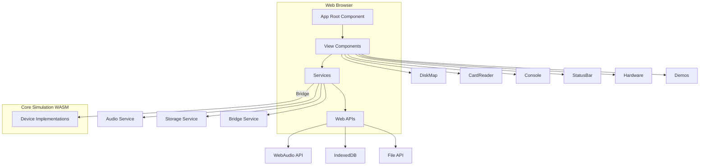
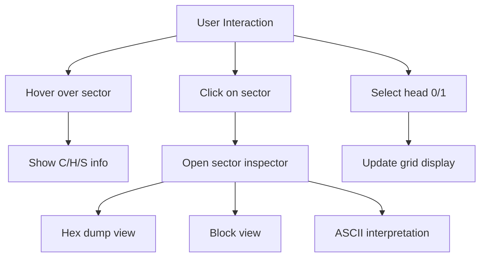
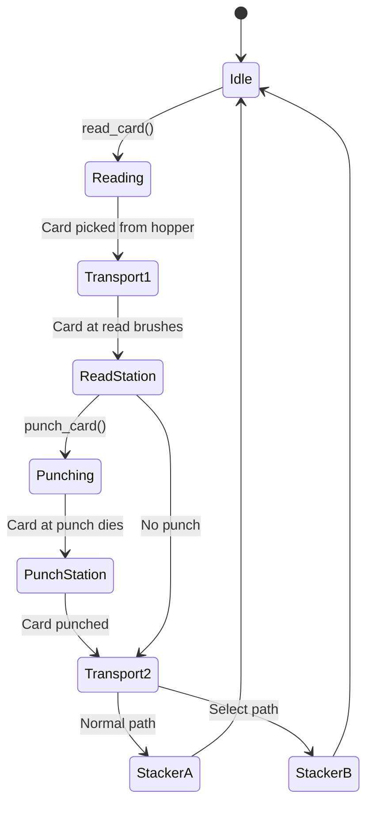
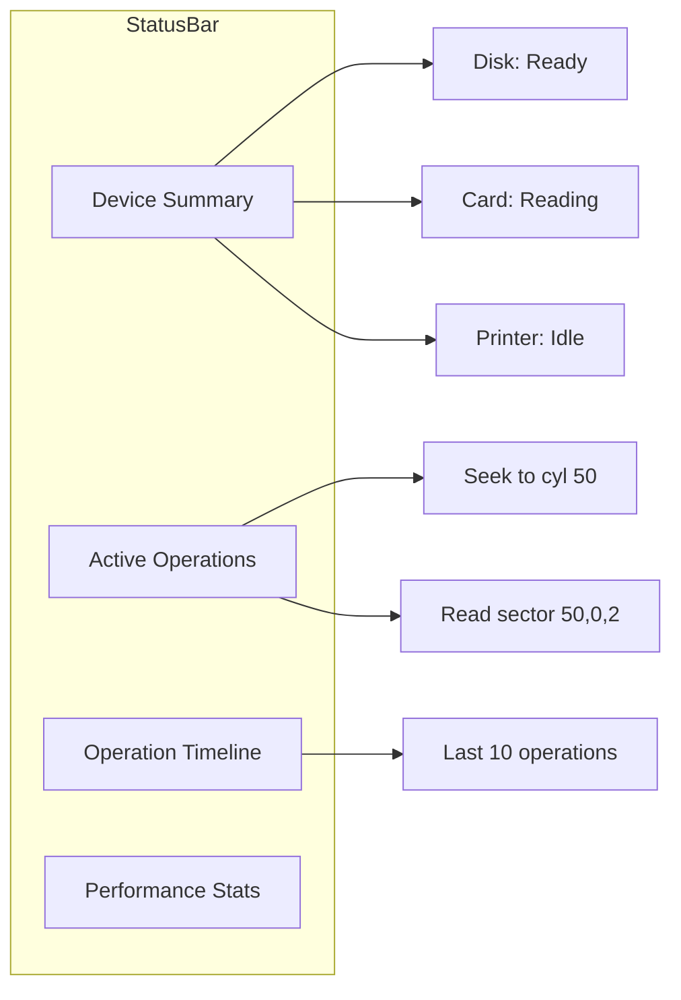
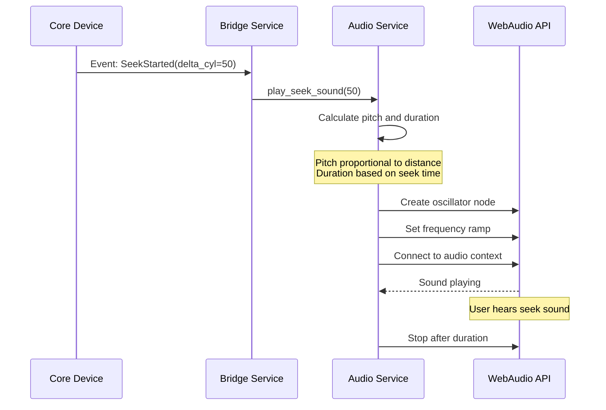
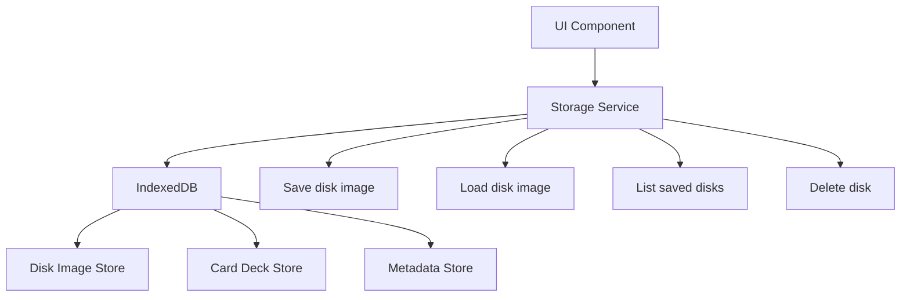
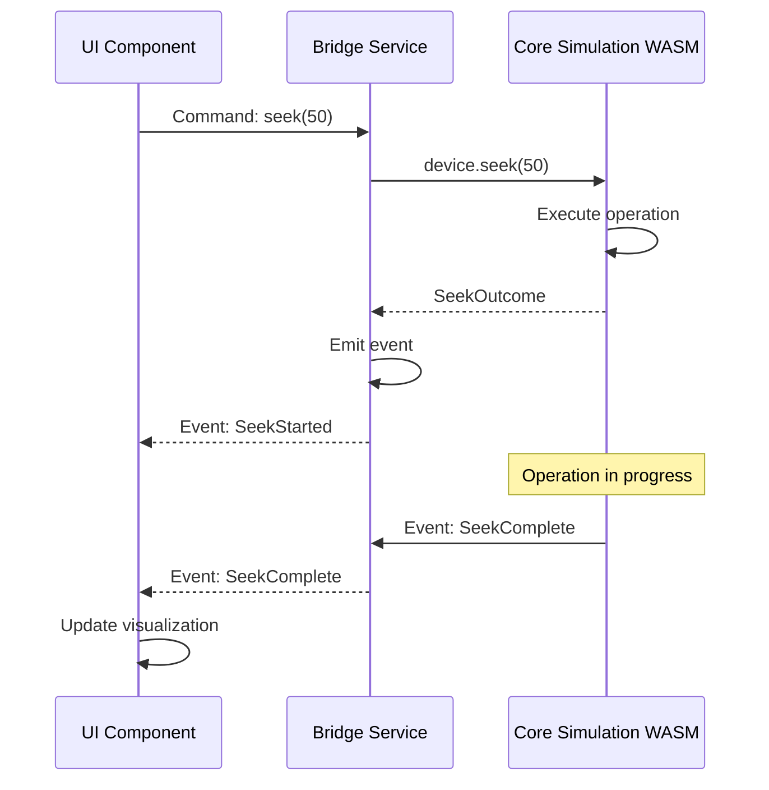

# Web UI Layer

Browser-based visualization and interaction interface built with Yew framework and WASM.

## Overview

**Crate:** `yew-ui`
**Target:** wasm32-unknown-unknown
**Framework:** Yew (React-like for Rust/WASM)
**Build Tool:** Trunk (WASM bundler and dev server)

The Web UI provides modern visualizations and interactions for the simulated IBM 1130 devices while maintaining historical accuracy in the underlying simulation.

## Architecture



## Component Organization

```
yew-ui/src/
|-- main.rs              # Entry point, WASM initialization
|-- app.rs               # Root component, routing, state
|-- views/
|   |-- mod.rs
|   |-- disk_map.rs      # Disk cylinder/sector visualization
|   |-- card_reader.rs   # Card hopper/transport/stackers
|   |-- console.rs       # Device status word display
|   |-- status_bar.rs    # System-wide status
|   |-- demos.rs         # Demo selector and runner
|   |-- hardware.rs      # Hardware catalog/documentation
|   |-- overview.rs      # System overview
|   |-- reference.rs     # Reference documentation
|   |-- demo_viewer.rs   # Individual demo display
|   |-- header_nav.rs    # Top navigation bar
|-- services/
    |-- mod.rs
    |-- audio.rs         # WebAudio integration for seek sounds
    |-- storage.rs       # IndexedDB persistence
    |-- bridge.rs        # WASM bridge to core-sim
```

## View Components

### DiskMap Component

**Purpose:** Visual representation of disk cylinders, heads, and sectors.

**Features:**
- **Grid layout:** Cylinder x Sector grid with head selection
- **Color coding:** Free/used/system sectors with different colors
- **Hover tooltips:** Show C/H/S coordinates, block number, file owner
- **Click inspection:** View sector/block contents in hex and ASCII
- **Activity animation:** Highlight active sectors during I/O
- **Seek visualization:** Show current head position



**State:**
```rust
struct DiskMapState {
    current_head: u8,          // Selected head (0 or 1)
    selected_sector: Option<SectorAddr>,
    hover_sector: Option<SectorAddr>,
    sector_colors: Vec<Color>, // Color for each sector
    active_operations: Vec<Operation>,
}
```

**Rendering:**
- Canvas-based or SVG-based rendering
- Responsive layout for different screen sizes
- Zoom and pan for large disks
- Performance optimization for 200 cylinders x 8 sectors = 1600 cells

### CardReader Component

**Purpose:** Animated visualization of card reader/punch operations.

**Features:**
- **Hopper:** Show card stack with count
- **Transport path:** Animate card movement
- **Read station:** Show card being read
- **Punch station:** Show punch operations per column
- **Stackers A/B:** Show output stacks with counts
- **Card content:** Display text on cards



**Animation timing:**
- Card pick: 50ms
- Transport: 100ms
- Read operation: 150ms total
- Punch operation: 167ms total
- Stacker deposit: 50ms

### Console Component

**Purpose:** Display device status words and control operations.

**Features:**
- **DSW display:** Show busy, error, attention, not-ready flags
- **Current operation:** Display operation in progress
- **Progress indicator:** Show operation completion percentage
- **Control buttons:** Start, stop, reset operations
- **Device selection:** Switch between devices

```rust
struct ConsoleState {
    devices: Vec<DeviceInfo>,
    selected_device: Option<DeviceId>,
    current_operation: Option<Operation>,
    progress: f32,  // 0.0 to 1.0
}

struct DeviceInfo {
    id: DeviceId,
    name: String,
    dsw: DeviceStatusWord,
}
```

### StatusBar Component

**Purpose:** System-wide status and activity timeline.

**Features:**
- **Device summary:** Quick status of all devices
- **Active operations:** List of running operations
- **Timeline:** Historical operation log
- **Timing mode:** Display current timing mode (none/realistic/fast)
- **Performance:** FPS and timing stats



### Demos Component

**Purpose:** Interactive demonstrations of device operations.

**Features:**
- **Demo selector:** Choose from available demos
- **Demo runner:** Execute demo scripts
- **Step-by-step:** Single-step through demo operations
- **Fast-forward:** Speed up demo execution
- **Visualization:** Show device state during demo

**Demo types:**
1. **Deck-to-Disk:** Load card deck and write to disk
2. **Disk-to-Punch:** Read disk file and punch cards
3. **Print Report:** Read disk and print to 1403
4. **Seek Performance:** Demonstrate seek timing
5. **Block I/O:** Show logical block operations

### Hardware Component

**Purpose:** Hardware catalog and documentation viewer.

**Features:**
- **Device catalog:** List all simulated devices
- **Specifications:** Display device specs and timing
- **Photos:** Historical IBM equipment photos
- **Documentation:** Link to reference materials

### Overview Component

**Purpose:** System overview and welcome screen.

**Features:**
- **System introduction:** Explain IBM 1130 system
- **Quick start:** Guide for first-time users
- **Feature highlights:** Key simulator features
- **Links:** Navigate to other sections

## Services

### Audio Service

**Purpose:** Synthesize seek sounds using WebAudio API.



**Implementation:**
```rust
pub struct AudioService {
    audio_context: Option<AudioContext>,
    enabled: bool,
}

impl AudioService {
    pub fn play_seek_sound(&self, delta_cyl: u16) {
        // Calculate pitch: 200Hz + delta * 10Hz
        let base_freq = 200.0;
        let freq = base_freq + (delta_cyl as f32 * 10.0);

        // Calculate duration from seek time
        let duration = Self::calculate_seek_time(delta_cyl);

        // Create oscillator
        let osc = self.audio_context.create_oscillator();
        osc.set_frequency(freq);
        osc.set_type(OscillatorType::Sawtooth);

        // Add envelope (attack/decay)
        let gain = self.audio_context.create_gain();
        gain.set_value_at_time(0.0, start);
        gain.linear_ramp_to_value_at_time(0.5, start + 0.01); // Attack
        gain.linear_ramp_to_value_at_time(0.0, start + duration); // Decay

        // Connect and play
        osc.connect(&gain);
        gain.connect(&self.audio_context.destination());
        osc.start();
        osc.stop_at(start + duration);
    }
}
```

**Sound characteristics:**
- **Seek sound:** Pitch proportional to seek distance
- **Duration:** Based on actual seek time
- **Envelope:** Attack and decay for realistic mechanical sound
- **Clunk:** Short low-frequency tone on settle

### Storage Service

**Purpose:** Persist disk images and card decks using IndexedDB.



**Operations:**
```rust
pub struct StorageService {
    db: Option<IdbDatabase>,
}

impl StorageService {
    pub async fn save_disk(&self, id: &str, data: &[u8]) -> Result<()> {
        let store = self.db.transaction("disks").object_store("disks");
        store.put_key_val(id, data)?;
        Ok(())
    }

    pub async fn load_disk(&self, id: &str) -> Result<Vec<u8>> {
        let store = self.db.transaction("disks").object_store("disks");
        let data = store.get(id)?.await?;
        Ok(data)
    }

    pub async fn list_disks(&self) -> Result<Vec<String>> {
        let store = self.db.transaction("disks").object_store("disks");
        let keys = store.get_all_keys()?.await?;
        Ok(keys)
    }
}
```

**Storage schema:**
- **Disks store:** Key = disk ID, Value = .dsk file blob
- **Decks store:** Key = deck ID, Value = .deck file blob
- **Metadata store:** Key = ID, Value = metadata JSON

### Bridge Service

**Purpose:** WASM bridge between UI and core simulation.



**Event types:**
```rust
pub enum DeviceEvent {
    SeekStarted { device: DeviceId, target_cyl: u16 },
    SeekComplete { device: DeviceId },
    ReadStarted { device: DeviceId, addr: SectorAddr },
    ReadComplete { device: DeviceId, data: Vec<u16> },
    WriteStarted { device: DeviceId, addr: SectorAddr },
    WriteComplete { device: DeviceId },
    CardRead { device: DeviceId, card: Card },
    CardPunched { device: DeviceId },
    LinePrinted { device: DeviceId, line: String },
    Error { device: DeviceId, error: String },
}
```

## User Interactions

### Loading Disk Images

1. User clicks "Load Disk" button
2. File picker dialog opens
3. User selects .dsk file
4. File read via FileAPI
5. Validate file format
6. Parse header and data
7. Create device instance
8. Save to IndexedDB
9. Update UI device list
10. Mount disk in simulator

### Running Demos

1. User selects demo from list
2. Demo script loaded
3. Required fixtures loaded (disk/deck)
4. Demo steps displayed
5. User clicks "Run" or "Step"
6. Commands executed on devices
7. Visualizations update in real-time
8. Audio feedback plays
9. Demo completes or user stops

### Inspecting Sectors

1. User hovers over sector in DiskMap
2. Tooltip shows C/H/S coordinates
3. User clicks sector
4. Inspector panel opens
5. Sector data displayed in hex
6. Block boundaries highlighted
7. ASCII interpretation shown
8. User can navigate to adjacent sectors

## Styling and Theming

### CSS Architecture

- **TailwindCSS:** Utility-first CSS framework
- **Custom components:** Styled components for devices
- **Responsive:** Mobile and desktop layouts
- **Dark mode:** Optional dark theme

### Color Scheme

**Disk Map:**
- Free sectors: Light gray (#E5E7EB)
- Used sectors: Blue (#3B82F6)
- System sectors: Red (#EF4444)
- Active I/O: Yellow (#FBBF24)

**Status indicators:**
- Ready: Green (#10B981)
- Busy: Yellow (#FBBF24)
- Error: Red (#EF4444)
- Not ready: Gray (#6B7280)

## Performance Optimization

### Rendering

- **Virtual scrolling:** For large disk maps
- **Canvas rendering:** For high-density visualizations
- **Incremental updates:** Only re-render changed components
- **RequestAnimationFrame:** Smooth 60fps animations

### WASM

- **Release builds:** Size and speed optimization
- **Code splitting:** Lazy load components
- **Web Workers:** Move heavy computation off main thread (future)

### Memory

- **Shared buffers:** Reuse buffers for I/O operations
- **Lazy loading:** Load disk images on-demand
- **Garbage collection:** Minimize allocations in hot paths

## Browser Compatibility

**Supported browsers:**
- Chrome/Chromium 90+
- Firefox 88+
- Safari 14+
- Edge 90+

**Required features:**
- WebAssembly
- WebAudio API
- IndexedDB
- ES6 modules

## Development Workflow

### Build and Run

```bash
# Development server with hot reload
cd crates/yew-ui
trunk serve --open

# Production build
trunk build --release
```

### Testing

```bash
# WASM tests in browser
wasm-pack test --headless --firefox

# Component tests
cargo test -p yew-ui
```

### Debugging

- **Browser DevTools:** Console, network, performance
- **wasm-bindgen:** Rust stack traces in browser
- **console_log!():** Logging from Rust to browser console

## Related Pages

- [[Architecture]] - Overall system architecture
- [[Core-Simulation]] - Device implementation layer
- [[Devices]] - Device specifications
- [[Development]] - Development workflow

## Related Documentation

- [UI Testing Guide](../documentation/ui-testing.md)
- [UI Test Results](../documentation/ui-test-results.md)
- [Deployment Guide](../documentation/deployment.md)
